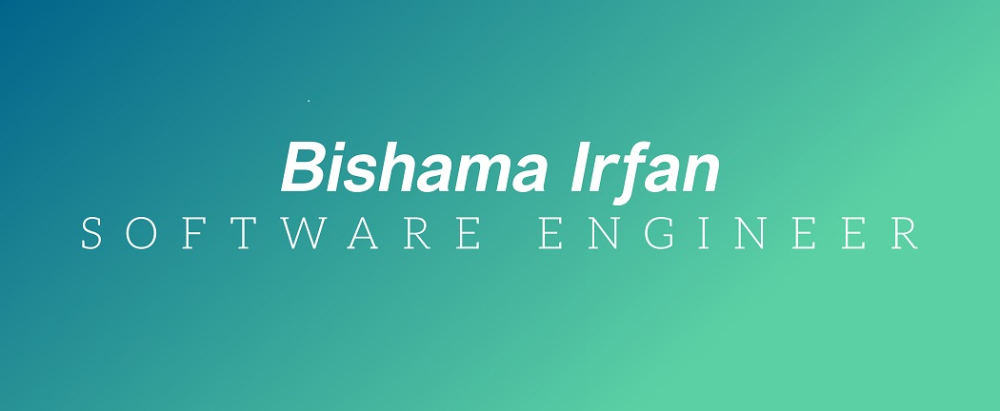

<h1 align="center">I'm Bishama, a full-stack developer</h1> 

  

  

   

<h2 align="center">Technologies</h2>

    
    
    
    
    
    
    
    
    

<h2 align="center">Connect</h2>

 
  
  

 

