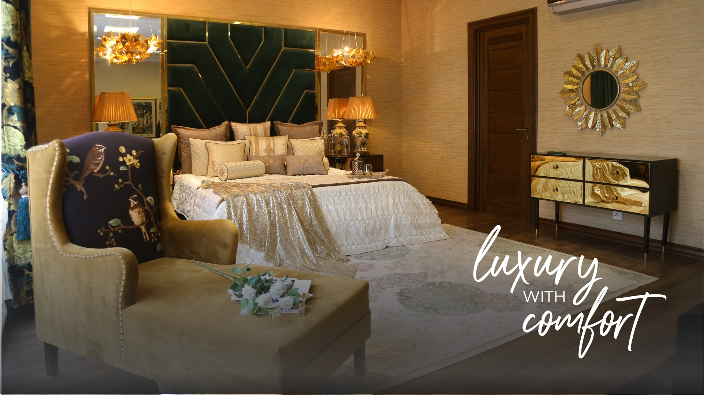

<h1 align="center">Hi 👋, I'm Bishama</h1>

  
  
  

As a freelance developer, I have proven record of creating and implementing successful front and back-end web applications

<h1 align="center">Projects</h1>
<table bordercolor="#66b2b2">
  
  <tr>
    <td width="50%" valign="top">
      <h3 align="center">SeismicAlert</h3>
         
        
         
        

  </a>
      

        
Dashboard to monitor real-time earthquakes

    </td>
    <td width="50%" valign="top">
      <h3 align="center">Feather company</h3>
         
      
         
        

          
  </a>

  </a>
      

        
Landing Page for a bedding company

    </td>
  </tr>
  
  <tr>
    <td width="50%" valign="top">
      <h3 align="center">Food Lounge</h3>
       
        
       
        

  
  </a>
  
  </a>
      

        
Restaurant web page.

    </td>
    <td width="50%" valign="top">
      <h3 align="center">Acrylics Portfolio</h3>
         
        
         
        

          
  
  
      

        
 Portfolio for Acrylics art                                                         

    </td>
  </tr>
</table>

